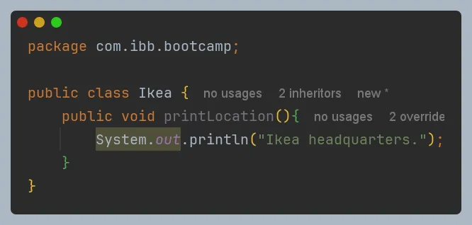
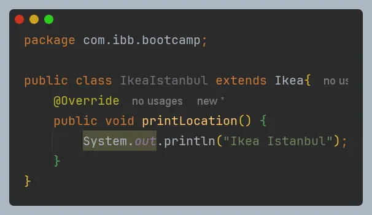
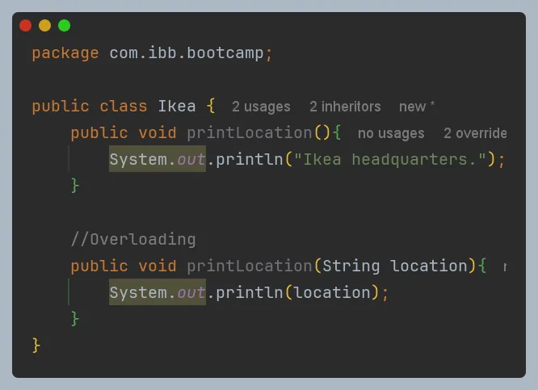

In the previous article, we talked about statics; now, we will discuss overriding and overloading.
# Method Overriding
Overriding methods in Java is used to express different behaviors across different subclasses while maintaining a common interface in the superclass.
It allows subclasses to define how they should behave through the implementation of abstract methods defined in super-classes or by overriding existing method implementations.

# Method Overloading
Overloading methods in Java is used to define different variables with the same method names.
