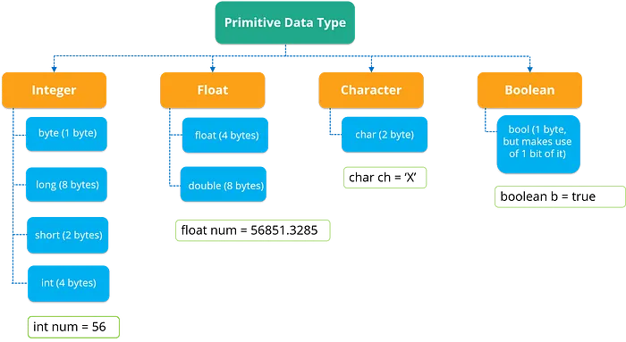
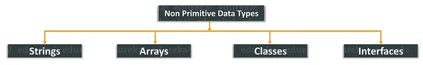

# Java Data Types: Primitive and Non-Primitive

Java classifies data types into two categories: **Primitive** and **Non-Primitive**.

## What Are Primitive Data Types in Java?

In Java, **primitive data types** are the most basic types that represent single values. They are not objects and provide the simplest form of data. Java offers eight primitive data types, each with specific characteristics such as size, range, and precision.

These types are used to store simple values like numbers, characters, and boolean states. They serve as the building blocks for more complex data structures.

### The Eight Primitive Data Types
*Note: 1 byte equals 8 bits.*

1. **byte**
    - **Length**: 8-bit
    - **Range**: -128 to 127
    - **Description**: The smallest integral data type. It's useful for saving memory in large arrays where memory savings are critical.

2. **short**
    - **Length**: 16-bit
    - **Range**: -32,768 to 32,767
    - **Description**: A slightly larger integral type compared to `byte`. It's used when memory savings are needed but `byte` isn't large enough.

3. **int**
    - **Length**: 32-bit
    - **Range**: -2,147,483,648 to 2,147,483,647
    - **Description**: The most commonly used integer data type. It is the default data type for integral values.

4. **long**
    - **Length**: 64-bit
    - **Range**: -9,223,372,036,854,775,808 to 9,223,372,036,854,775,807
    - **Description**: Used when a wider range than `int` is required.
    - **Warning**: Not recommended for large values unless absolutely necessary due to its large bit size.

5. **float**
    - **Length**: 32-bit
    - **Range**: ±1.4 × 10⁻⁴⁵ to ±3.4 × 10³⁸
    - **Precision**: 7 decimal digits
    - **Description**: A single-precision floating-point type used for decimal values with lower precision than `double`.
    - **Note**: Not recommended for financial applications due to possible rounding errors. For monetary calculations, use `BigDecimal` in financial systems.

6. **double**
    - **Length**: 64-bit
    - **Range**: ±4.9 × 10⁻³²⁴ to ±1.8 × 10³⁰⁸
    - **Precision**: 15 decimal digits
    - **Description**: A double-precision floating-point type used for more accurate decimal numbers. It is commonly used in scientific and engineering applications where more precision is needed.

7. **char**
    - **Length**: 16-bit
    - **Range**: 0 to 65,535 (Unicode character set)
    - **Description**: Used to represent a single character (e.g., a letter, symbol, or digit) in Unicode encoding. It is the only primitive data type in Java that stores a single character.

8. **boolean**
    - **Length**: 1-bit (typically uses more memory depending on implementation)
    - **Values**: `true` or `false`
    - **Description**: Represents one of two possible values, `true` or `false`, and is typically used for conditional testing and control flow.

---

## Non-Primitive Types (Reference Types)

Non-primitive types are also known as **reference types**. These are not predefined by Java and can be defined by the programmer.

- **Array**
- **String**: A `String` is a sequence of characters (essentially a `char` array).
- **Classes**
- **Interfaces**

---

## Difference Between Primitive and Non-Primitive Types

| Feature              | **Primitive Types**                 | **Non-Primitive Types**         |
|----------------------|-------------------------------------|---------------------------------|
| **Definition**        | Predefined in Java                  | Defined by the programmer       |
| **Naming Convention** | Starts with a lowercase letter      | Starts with an uppercase letter |
| **Memory Usage**      | More efficient (fixed size)         | May use more memory             |
| **Nullability**       | Cannot be `null`                    | Can be `null`                   |
| **Methods**           | No methods                          | Can have methods                |

---

Thanks for taking the time to read this! Let me know if you'd like to dive deeper into any specific topic.
