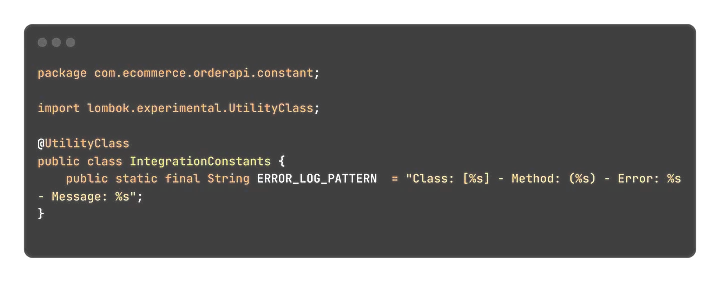
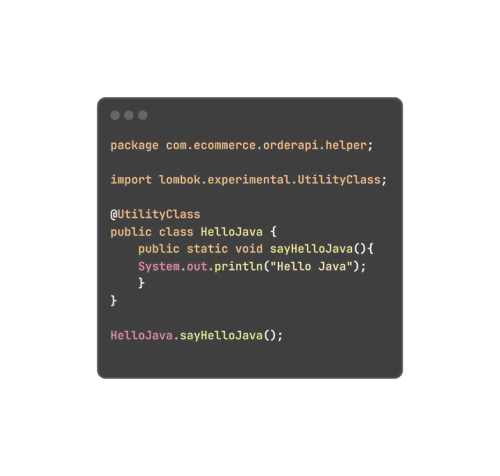
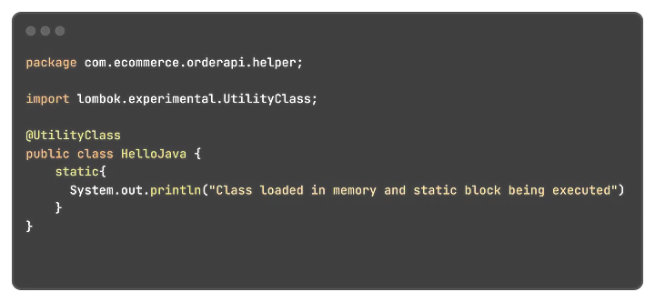
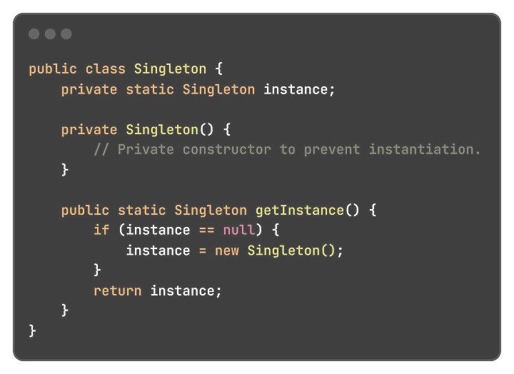

In this article, we’ll introduce the importance of the static keyword in Java. Have you come across this question in an interview before? What’s the deal with static in Java?

Well, let’s start with know importance of the static keyword.

# Basics of the static keyword
The static keyword is used to create class level variables and methods in Java.
Do not confuse static variables with static methods or instance variables and methods, 
as they are not the same. The static keyword allows data to be shared among all instances of the class.

# Static Variables
Useful for maintaining common data across objects. Let’s review the microservice utility class for logging.

In this utility class, `ERROR_LOG_PATTERN` constant is static. This helping to us for formatting the log outputs.

# Static Methods
Static methods are invoked without creating an object of the class.

# Static Block
The static block is a special block of code inside a class that is executed when the class is loaded into the memory. 
It is often used for initializing static variables or performing one-time setup tasks.

# Singleton Pattern
The static keyword is instrumental in implementing the Singleton design pattern, ensuring that a class has only one instance.

# Conclusion
Best practices include using static elements sparingly, avoiding global state, and favoring instance variables when appropriate. Also, be mindful of potential increases in memory usage.