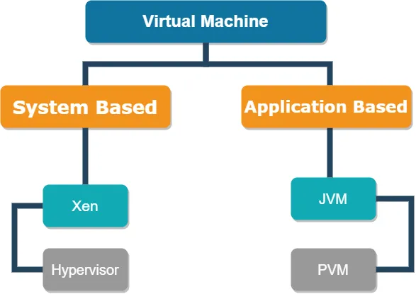
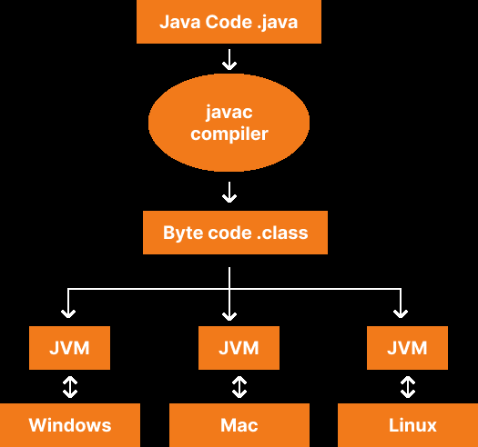
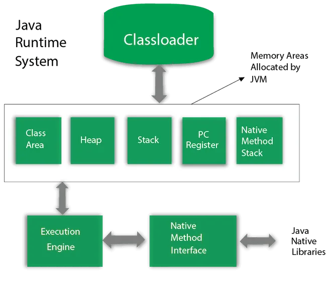
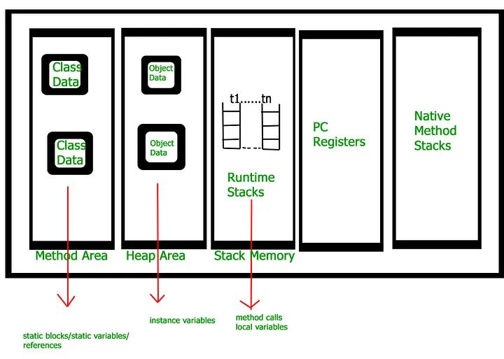

[Youtube Video](https://www.youtube.com/watch?v=x35Bg7jud44&ab_channel=SonKodB%C3%BCk%C3%BCc%C3%BC)

In this md file, we'll introduce java virtual machine. Every developer must know this.

# First we need know the VM
Before transferring JVM, I want to touch on VM. Virtual Machine means it does not exist physically. But it is the structure that you will feel is there. VM is divided into 2. Operation based and application based.

System-based VM allows sharing physical machine resources between different virtual machines. However, application-based VM does not have any hardware and needs some applications or software to create their virtual environment. Application-based VM is not a downloadable program. It is a system that comes inside the application and only runs when the application runs and ends when the application ends.

# Java Virtual Machine (JVM)
If someone asks what the JVM is to us, basically everyone answers the question like it runs the Java bytecode (.class) and transforms it to machine language.
That's a true definition, but it's missing. Jvm is not downloadable, works with JRE(Java Runtime Environment)
Many people think JVM is static, but this is a misconception. The JVM will generate an instance for each project that is booted up.
Well, JVM comes with JRE. What's the benefit to us? System based bytecode transforms to machine language at the time. Java says **write once run everywhere** at this point.

# Java Runtime Environment (JRE)
Java Runtime Environment (JRE) supplies minimum requirements for running Java applications.
JVM consists of Java core packages, classes, and supportive files.

# Java Development Kit (JDK)
JDK is an environment for software development. It is used to develop Java applications.
It includes JRE, Java, Javac, Jar, Javadoc, and other essential packages needed for developing Java applications.

# Jvm Internal Structure

JVM has three mechanisms, as shown above.
- Class Loader
- Memory Area
- Execution Engine

## Class Loader
Class Loader is responsible for load .class file to memory area. Class Loader is an abstract class. 
Class Loader consists of three mechanism as shown below.

- Loading
- Linking
- Initialization

### Loading
The class is loaded to the JVM; it creates an object and puts it on the heap area.
The object type of the class is generated only when the JVM is loaded once.

### Linking
This process, class file data Linking to the memory. 
It starts with verification to provide the class file and the compiler.

### Initialization
That's the final part of the Class Loader. At this stage, actual values are assigned to all static and instance variables.
Initialization has one role: all classes must run before active usage. Six conditions that trigger initialization:
- Use the new keyword.
- Call the static methods.
- Assign the values to static areas.
- Start the class.
- In the Reflection API, use getInstance().
- Concretion the Subclass.

4 Ways to Start a Class in the Java:
- New keyword : The standard way to create an instance.
- Reflection API: Uses the "getInstance" method to create an instance dynamically.
- Clone Method: Creates a new object by copying data from an existing object.
- IO.Stream: Deserializes an object by reading data from a stream.

# Memory Area

## Method Area
Method area stores information of the class. Static variables, class constructors, and related other information are stored here.
## Heap
Heap stores all information of the object (and inherited super classes). When new instance was created it will create on heap. An object will have knowledge of its instance variables.
If not referenced to an object it will be destroyable and suitable to garbage collector.

## Stack
The stack holds the methods and local variables. Adds the method to the stack when calling a method. If a method calls another method, the new method will be added to the top of the stack.
The method at the top of the stack is the one currently being executed. When a method finishes its execution, it is removed from the stack along with its local variables.

## PC Register (Program Counter)
Each thread in the JVM will have its own register. At any given point, 
a thread in the JVM is executing a single method. 
If the method being executed by the thread is not a native method, 
information about the next method to be executed will be stored in the Program Counter (PC) Register. 
The PC Register will hold the address of the method currently being executed by the thread. 
If the thread is executing a native method, the value of the address will be undefined.

## Native Method Area
The Native Method Area facilitates the loading or accessing of any native methods and method information. 
The implementation of an interpreter for Java Virtual Machine instructions, 
which can be configured in a language like C, will use the Native Method Area in this case.

## Execution Engine
The final stage of the JVM is executing the class file. Executing Engine has three component:
- Interpreter (Translator)
- JIT(Just In Time Compiler)
- Garbage Collector

## Interpreter
At the program's start on the process, the interpreter will read bytecode based on the row.
This process will use a kind of dictionary that implies the conversion of bytecode into machine instructions.
The main advantage is the interpreter loads fast and runs fast, but running source code again cannot optimize.

## Just In Time Compiler (JIT)
Just In Time Compiler (JIT Compiler) it was introduced to overcome the main disadvantage of the interpreter.
JIT remembers the code blocks. For example, there is a class called 'Employee' and it has a method 'getEmployeeID()'. If a program calls the 'getEmployeeID()' method 777 times, the interpreter would re-invoke it every time it is executed. However, the JIT compiler can identify these repeated code segments and store them as native code in the cache. Since they are stored,
the next time the JIT compiler will use the native code stored in the cache.